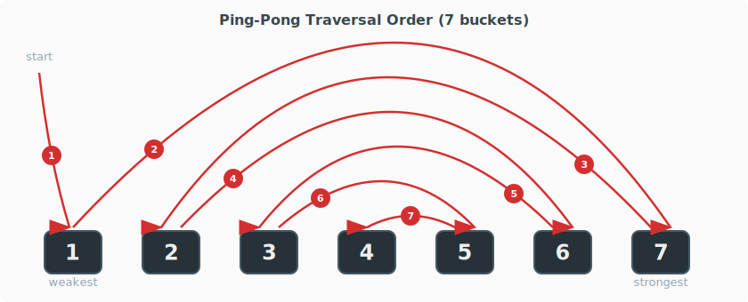

# Matchmaking System — Technical Specification

---

## 1. Overview

The matchmaking system groups competition participants by skill level to ensure fair play. At competition start, after registration closes, it divides all registered players into groups based on their personal competitive rating (PCR). Each group then competes independently — with its own scoring table, leaderboard, and full reward pool — so that players of similar skill compete for rewards among themselves rather than against significantly stronger or weaker opponents.

Matchmaking applies only to Competitions (`TournamentKinds.Competition = 3`). Tournaments and User Generated Competitions do not use the matchmaking system currently.

Matchmaking runs once, at the moment of competition start. Its output — the grouping — directly influences the competition: bracket-specific multipliers (`RatingMultiplier`, `RewardMultiplier`) allow designers to tune rating gains and reward values per skill tier, incentivizing participation across all brackets.

---

## 2. Terminology

| Term        | Definition                                                                                                                                                   | Code Type           |
|-------------|--------------------------------------------------------------------------------------------------------------------------------------------------------------|---------------------|
| **Bracket** | A named rating range defined in the competition JSON config. Used for initial player classification. Brackets must not overlap or have gaps.                 | `TournamentBracket` |
| **Bucket**  | A runtime container of players. One bucket is created per bracket at the start of the algorithm. Players may be moved between buckets during balancing.      | `TournamentBucket`  |
| **Group**   | The final output of matchmaking. A set of players who compete together and share a full reward pool. Each non-empty bucket is split into one or more groups. | `TournamentGroup`   |

**Example** (MinSize=20, 96 participants across 3 brackets):

- Initial buckets: `[42 / 23 / 31]` (Newbies / Middles / Tops)
- Possible group outcomes: `[42 / 23 / 31]` (3 groups), `[42 / 0 / 27+27]` (3 groups), `[32+32+32 / 0 / 0]` (3 groups)

**Player data:**

| Term    | Definition                                                                                                                     | Code                               |
|---------|--------------------------------------------------------------------------------------------------------------------------------|------------------------------------|
| **PCR** | Personal Competitive Rating — the player's rating used to classify them into brackets. Stored in the player profile; null = 0. | `Profile.CompetitionRating` (int?) |

**Rules and algorithms:**

| Term                      | Definition                                                                                                                                                                                  | Details                                                     |
|---------------------------|---------------------------------------------------------------------------------------------------------------------------------------------------------------------------------------------|-------------------------------------------------------------|
| **NSR** (No-Split Rule)   | The lowest bracket (MinRating=0) cannot be split into multiple groups if it contains participants moved from stronger brackets during balancing. Highest priority rule.                     | [Section 5](#5.-Rules)                                      |
| **WSR** (Weak-Small Rule) | When distributing groups, weaker buckets get priority for more, smaller groups. Remainders go to stronger buckets.                                                                          | [Section 5](#5.-Rules)                                      |
| **FFS** (Free-Fill-Swap)  | The group budget allocation algorithm used when `MaxGroupCount` is set. Named after its three optimization phases: Free, Fill, and Swap. Also known as "Fair Fill Strategy" in GDD context. | [Section 4.3](#Mode-2%3A-Global-Budget-(MaxGroupCount-set)) |
| **Phase A**               | Ping-pong traversal — the bucket balancing pass that visits buckets from edges to center, pulling participants from neighbors.                                                              | [Section 4.2](#Phase-A%3A-Ping-Pong-Traversal)              |
| **Phase B**               | Final merge — incomplete buckets after Phase A are merged into their nearest stronger (or weaker) neighbor.                                                                                 | [Section 4.2](#Phase-B%3A-Incomplete-Bucket-Merge)          |

---

## 3. Configuration

### 3.1 JSON Structure

```json
{
  "Grouping": {
    "MinSize": 20,
    "MaxGroupCount": 3,
    "Brackets": [
      { "BracketId": 1, "BracketName": "Newbies", "MinRating": 0,    "RatingMultiplier": 1.0, "RewardMultiplier": 1.0 },
      { "BracketId": 2, "BracketName": "Middles", "MinRating": 101,  "RatingMultiplier": 1.0, "RewardMultiplier": 1.0 },
      { "BracketId": 3, "BracketName": "Tops",    "MinRating": 1001, "RatingMultiplier": 2.0, "RewardMultiplier": 1.5 }
    ]
  }
}
```

### 3.2 Grouping Parameters

| Parameter       | Type | Required | Default | Description                                                                                                                       |
|-----------------|------|----------|---------|-----------------------------------------------------------------------------------------------------------------------------------|
| `MinSize`       | int  | yes      | —       | Minimum participants per group.                                                                                                   |
| `TargetSize`    | int? | no       | null    | Ideal average group size. Algorithm tries to create groups close to this value.                                                   |
| `MaxSize`       | int? | no       | null    | Upper limit on group size. When set, the effective value is `max(MaxSize, MinSize × 2 − 1)`. Ignored when `MaxGroupCount` is set. |
| `MaxGroupCount` | int? | no       | null    | Global cap on total number of groups across all buckets. Enables the FFS algorithm. Takes priority over `MaxSize`.                |

**Constraints:**

- `MinSize ≥ 1`
- `TargetSize ≥ MinSize` (when set)
- `MaxSize ≥ MinSize × 2 − 1` (when set)
- When both `MaxGroupCount` and `MaxSize` are set, `MaxGroupCount` takes priority and `MaxSize` is ignored

**Note:** These constraints are documented but **not enforced at runtime**. See [Section 7: Validation](#7.-Validation).

### 3.3 Parameter Combinations

| MinSize | TargetSize | MaxSize | MaxGroupCount | Behavior                                       |
|---------|------------|---------|---------------|------------------------------------------------|
| 20      | —          | —       | —             | 1 group per bucket, no splitting               |
| 20      | —          | —       | 5             | Up to 5 groups total, distributed by FFS       |
| 20      | —          | 50      | —             | Groups guaranteed ≤ 50 participants            |
| 20      | 30         | —       | —             | Groups ~30 participants, unlimited count       |
| 20      | 30         | —       | 5             | Up to 5 groups, target size ~30, FFS optimizes |
| 20      | 30         | 50      | —             | Groups ~30, hard cap at 50                     |

These are illustrative examples, not an exhaustive list. Any combination satisfying the constraints in Section 3.2 is valid.

### 3.4 Bracket Parameters

| Parameter          | Type   | Description                                                                                                                |
|--------------------|--------|----------------------------------------------------------------------------------------------------------------------------|
| `BracketId`        | int    | Unique identifier.                                                                                                         |
| `BracketName`      | string | Internal name for designers. Not displayed in game.                                                                        |
| `MinRating`        | int    | Lower rating boundary (inclusive). First bracket must be 0.                                                                |
| `MaxRating`        | int    | Upper rating boundary (inclusive). **Auto-computed** — do not set manually.                                                |
| `RatingMultiplier` | double | Multiplier applied to rating earned from competition results. Default 1.0. Applied at reward time, not during matchmaking. |
| `RewardMultiplier` | double | Multiplier applied to money rewards. Default 1.0. Applied at reward time, not during matchmaking.                          |

**MaxRating auto-computation** (`InitializeGrouping()`):

- For each bracket (sorted by MinRating): `MaxRating = NextBracket.MinRating − 1`
- Highest bracket: `MaxRating = int.MaxValue`
- This ensures continuous, gap-free coverage of the entire rating range.

---

## 4. Algorithm

The algorithm has two stages: **bucket balancing** (ensure every bucket has ≥ MinSize participants) and **group creation** (split buckets into competition groups).

### 4.1 Bucket Creation

1. Create one bucket per bracket, inheriting all bracket properties.
2. Sort all participants by `CompetitionRating` ascending.
3. Assign each participant to the bucket matching their rating range `[MinRating, MaxRating]`.
4. Cache min/max participant ratings per bucket.

### 4.2 Bucket Balancing

#### Phase A: Ping-Pong Traversal

The algorithm visits buckets in an alternating pattern from edges to center:

```
Bucket[0] → Bucket[n-1] → Bucket[1] → Bucket[n-2] → Bucket[2] → ...
```

This protects the weakest and strongest brackets first, leaving middle brackets as the last to be adjusted.

For each visited bucket:

- **Skip** if empty (0 participants) or already complete (≥ MinSize).
- **Fill** if `0 < count < MinSize`: pull participants from adjacent **unvisited** buckets until MinSize is reached.
    - From a **stronger** neighbor: take the participant with the **lowest** rating first (closest to the current bucket's range).
    - From a **weaker** neighbor: take the participant with the **highest** rating first.
    - If the immediate neighbor is exhausted, continue to the next unvisited neighbor in the same direction.
- Once visited, a bucket is **closed** — no participants can be pulled from it.

**Traversal examples:**

**3 brackets:** `[1]`, `[2]`, `[3]`

| Visit | Bucket | Can pull from |
|-------|--------|---------------|
| #1    | `[1]`  | `[2]`, `[3]`  |
| #2    | `[3]`  | `[2]`         |
| #3    | `[2]`  | —             |

**4 brackets:** `[1]`, `[2]`, `[3]`, `[4]`

| Visit | Bucket | Can pull from       |
|-------|--------|---------------------|
| #1    | `[1]`  | `[2]`, `[3]`, `[4]` |
| #2    | `[4]`  | `[3]`, `[2]`        |
| #3    | `[2]`  | `[3]`               |
| #4    | `[3]`  | —                   |

**5 brackets:** `[1]`, `[2]`, `[3]`, `[4]`, `[5]`

| Visit | Bucket | Can pull from              |
|-------|--------|----------------------------|
| #1    | `[1]`  | `[2]`, `[3]`, `[4]`, `[5]` |
| #2    | `[5]`  | `[4]`, `[3]`, `[2]`        |
| #3    | `[2]`  | `[3]`, `[4]`               |
| #4    | `[4]`  | `[3]`                      |
| #5    | `[3]`  | —                          |

**Visualization (7 buckets):**



#### Phase B: Incomplete Bucket Merge

After Phase A, some buckets may still have fewer than MinSize participants (typically the last bucket in traversal order, or buckets with very few participants overall).

For each incomplete bucket (0 < count < MinSize):

1. **Prefer stronger:** find the nearest non-empty bucket with a **higher** MinRating.
2. **Fallback weaker:** if no stronger bucket exists, find the nearest non-empty bucket with a **lower** MinRating.
3. Move all participants from the incomplete bucket to the target.

This "merge upward" policy ensures low-rated players are not flooded with strong players unless absolutely necessary.

### 4.3 Group Creation

After balancing, each non-empty bucket is split into one or more groups. The algorithm operates in one of two modes depending on whether `MaxGroupCount` is set.

#### Mode 1: Per-Bucket (no MaxGroupCount)

Each bucket independently determines its group count:

1. **NSR check:** if the bucket is a no-split bucket (see [Section 5](#5.-Rules)), group count = 1.
2. **Otherwise:** call `ComputeGroupCount(participants, MinSize, TargetSize, MaxSize)`.

**ComputeGroupCount logic:**

When `TargetSize` is set:

1. Compute projected count: `projected = ⌈participants / TargetSize⌉`
2. Try `increased = projected + 1` (smaller groups preferred)
3. If `increased` produces avg < MinSize or is farther from TargetSize → use `projected`
4. If `projected` produces avg < MinSize or is farther from TargetSize → use `decreased = max(1, projected − 1)`
5. When `MaxSize` is set: enforce minimum count `⌈participants / effectiveMaxSize⌉` where `effectiveMaxSize = max(MaxSize, 2 × MinSize − 1)`

When only `MaxSize` is set (no TargetSize):

- Group count = `⌈participants / effectiveMaxSize⌉`

When neither is set:

- Group count = 1

#### Mode 2: Global Budget (MaxGroupCount set)

Uses the **Fair Fill Strategy (FFS)** algorithm to distribute a fixed group budget across all buckets.

##### Phase 1 — Maximize

For each bucket:

- NSR buckets: `groupCount = 1` (locked, cannot change)
- Other buckets: `groupCount = max(1, ⌊participants / MinSize⌋)`

This produces the maximum possible total groups.

##### Phase 2 — Reduce

While `totalGroups > MaxGroupCount`:

1. Find the bucket with the **smallest average group size** that has ≥ 2 groups.
2. **Tie-break (WSR):** among equal-avg buckets, the **strongest** (highest MinRating) loses a group first.
3. Decrement that bucket's group count.

Average comparisons use exact **Rational** arithmetic to avoid floating-point imprecision.

##### Phase 3 — Optimize (Free / Fill / Swap)

Repeat until no changes occur (max 100 iterations):

**Free Step:**
For each below-target bucket (avg group size < TargetSize):

- Reduce group count as long as it brings avg closer to TargetSize.
- Each reduction frees 1 slot in the global budget.

**Fill Step:**
Distribute freed slots to above-target buckets (avg > TargetSize):

1. Find the bucket farthest from TargetSize (largest potential improvement).
2. **Tie-break (WSR):** weaker bucket (lower MinRating) gets the slot first.
3. Reject if the new avg would be < MinSize.

**Swap Step:**
Budget-neutral transfer: one bucket gives up a group, another gains one.

For each candidate donor/recipient pair:

- Donor must have ≥ 2 groups and not be locked (NSR).
- Recipient must have room: `participants < MinSize × (groupCount + 1)`.
- Compute improvement using `ComputeSwapImprovement()`.

**Improvement formula** (exact Rational arithmetic):

```
distance(P, G, T) = |P − T × G| / G

improvement = distance_before_donor + distance_before_recipient
            − distance_after_donor  − distance_after_recipient
```

Where `P` = participant count, `G` = group count, `T` = TargetSize.

A positive improvement means the swap brings both buckets closer to TargetSize.

**Swap tie-break cascade:**

1. Largest improvement wins.
2. Equal improvement: prefer **weaker** recipient (lower MinRating) — keeps weak groups small.
3. Equal recipient: prefer **stronger** donor (higher MinRating) — strong buckets absorb cost.

Apply the best swap if improvement > 0; repeat.

When `TargetSize` is null, the Optimize phase is skipped (Free/Fill/Swap have no target to optimize toward). Only Maximize and Reduce are performed.

#### Partition & Assignment

After group counts are determined (by either mode):

**PartitionBucket():** Divide participants evenly into groups.

- Base size: `⌊participants / groupCount⌋`
- Remainder distributed to the **last** (strongest) groups — each gets +1 participant.

**ReassignGroupsToBuckets():** For each group:

1. Compute the **median** participant rating.
2. Find the bracket whose `[MinRating, MaxRating]` range contains the median.
3. Assign the group's `BracketId` to that bracket.
4. Mark participants whose rating falls outside the assigned bracket as `IsMoved = true`.

**Group naming:** Excel-style alphabetic: A (0), B (1), ..., Z (25), AA (26), AB (27), ...

---

## 5. Rules

### No-Split Rule (NSR)

**Condition:** A bucket is a no-split bucket when ALL of the following are true:

- `MinRating == 0` (lowest bracket)
- Has at least one participant
- `MaxParticipantRating > bucket.MaxRating` (contains participants moved from stronger brackets)

**Effect:** The bucket always produces exactly 1 group, regardless of MaxSize, MaxGroupCount, or TargetSize.

**Priority:** Highest. NSR overrides all other group-splitting logic.

**Rationale:** When strong players are forced into the newbie bucket during balancing, splitting that bucket would create a group of mixed skill levels — defeating the purpose of matchmaking. Keeping it as one group ensures the damage is contained.

### Weak-Small Rule (WSR)

WSR is not a single check but a design principle applied at multiple points:

| Where                | Effect                                                                         |
|----------------------|--------------------------------------------------------------------------------|
| FFS Phase 2 (Reduce) | Strongest bucket loses a group first when averages are tied.                   |
| FFS Phase 3 (Fill)   | Weakest bucket receives a freed group slot first when equally far from target. |
| FFS Phase 3 (Swap)   | Weaker recipient preferred when improvement is equal.                          |
| PartitionBucket()    | Remainder participants go to the last (strongest) groups.                      |

**Rationale:** Weaker players benefit more from smaller, more homogeneous groups. Stronger players can tolerate larger groups.

### Phase B Merge Priority

Incomplete buckets merge into the nearest **stronger** bucket first (fallback: weaker).

**Rationale:** Merging "upward" protects the lowest bracket from receiving strong players unnecessarily. A mid-level bucket merging into the top bracket is less disruptive than merging into the newbie bracket.

---

## 6. Data Flow

### Database Tables

| Table                         | Matchmaking Columns                      |
|-------------------------------|------------------------------------------|
| `TournamentParticipants`      | `BracketId` (int), `GroupName` (char(2)) |
| `TournamentIndividualResults` | `BracketId` (int), `GroupName` (char(2)) |
| `TournamentSecondaryResult`   | `BracketId` (int), `GroupName` (char(2)) |
| Archive tables (prefixed)     | Same columns                             |

### Write Operation

`UpdateTournamentGroup()` — called once per participant after grouping completes. Sets `BracketId` and `GroupName` on both `TournamentParticipants` and `TournamentIndividualResults` for the given tournament and user.

### Read Operation

`GetTournamentParticipants(tournamentId, approvedOnly)` — loads participants with `UserId` and `CompetitionRating` for the matchmaking algorithm.

---

## 7. Validation

| #  | Check                                      | Where / Risk                                                          |
|----|--------------------------------------------|-----------------------------------------------------------------------|
| 1  | Participant count ≥ MinParticipants        | `TournamentStartAdapter`                                              |
| 2  | Tournament end date not passed             | `TournamentStartAdapter`                                              |
| 3  | Pond is active                             | `TournamentStartAdapter`                                              |
| 4  | Bracket MaxRating auto-filled (continuity) | `InitializeGrouping()`                                                |
| 5  | `maxGroupCount ≥ 1`, `minSize ≥ 1`         | `Debug.Assert` — not enforced in Release builds                       |
| 6  | `MinSize > 0`                              | Division by zero in group count calculations                          |
| 7  | `TargetSize ≥ MinSize` (when set)          | Algorithm may produce groups below MinSize                            |
| 8  | `MaxSize ≥ MinSize × 2 − 1` (when set)    | Impossible to split: both halves would be below MinSize               |
| 9  | Bracket rating overlap/gap detection       | Players may land in wrong bucket or fall through                      |
| 10 | Bracket sort order verification            | `InitializeGrouping()` assumes descending sort — silent wrong results |

Checks 1–4 are implemented. Check 5 is debug-only. Checks 6–10 are not yet implemented — see matchmaking module backlog.

---

## 8. Code Map

| Component             | File                                                                |
|-----------------------|---------------------------------------------------------------------|
| Main algorithm        | `Shared\SharedLib\Tournaments\MatchmakingLogic.cs`                  |
| Grouping rule model   | `Shared\ObjectModel\Tournaments\TournamentGroupingRule.cs`          |
| Bracket model         | `Shared\ObjectModel\Tournaments\TournamentBracket.cs`               |
| Bucket model          | `Shared\ObjectModel\Tournaments\TournamentBucket.cs`                |
| Group model           | `Shared\ObjectModel\Tournaments\TournamentGroup.cs`                 |
| Participant model     | `Shared\ObjectModel\Tournaments\TournamentGroupParticipant.cs`      |
| Ping-pong iterator    | `Shared\SharedLib\Helpers\PingPongTraversalIterator.cs`             |
| Rational arithmetic   | `Shared\SharedLib\Helpers\Rational.cs`                              |
| Lifecycle entry point | `Shared\SharedLib\Tournaments\TournamentStartAdapter.cs`            |
| Initialization helper | `Shared\SharedLib\Tournaments\TournamentsHelper.cs`                 |
| DB write              | `Dal\Sql.MsSql\Tournaments\SqlTournamentProvider.cs`                |
| DB interface          | `Dal\Sql.Interface\Tournaments\ITournamentProvider.cs`              |
| Tests                 | `Shared\SharedLib.Tests\Tournaments\MatchmakingLogicTests.cs`       |
| Test helpers          | `Shared\SharedLib.Tests\Tournaments\Helpers\MatchmakingTestCase.cs` |
