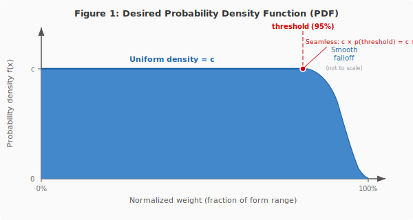
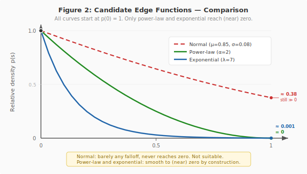
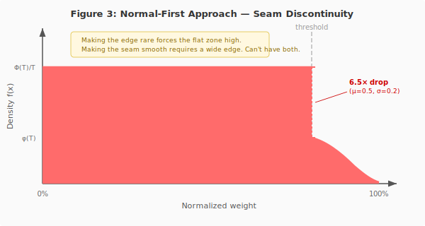
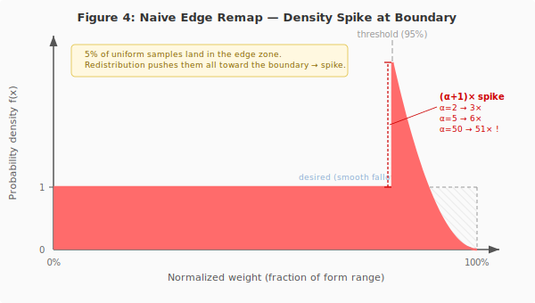
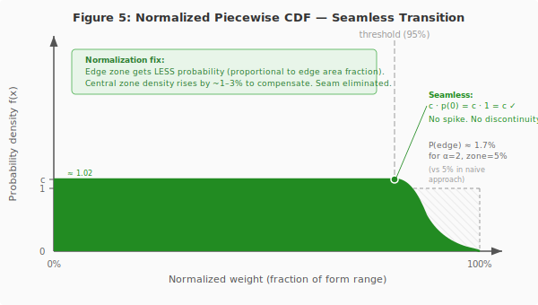
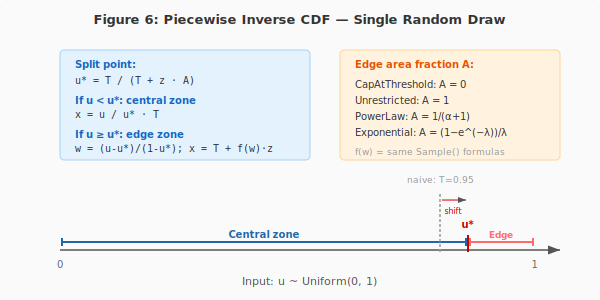

# Edge Distribution — Design Analysis

How to make fish near maximum weight progressively rarer while keeping the rest of the distribution uniform — and how to implement it correctly.

<!-- {toc} -->

---

## Notation

The following symbols are used throughout this article:

| Symbol     | Meaning                                                                                         |
|------------|-------------------------------------------------------------------------------------------------|
| ***x***    | Normalized weight position within the form range (***0*** = `MinWeight`, ***1*** = `MaxWeight`) |
| ***T***    | Threshold — boundary between central and edge zones (e.g. ***0.95***)                           |
| ***z***    | Edge zone width: ***z = 1 − T*** (e.g. ***0.05***)                                              |
| ***s***    | Position within edge zone, normalized to ***[0, 1]***: $s = \frac{x - T}{z}$                    |
| ***p(s)*** | Edge function — defines the density shape in the edge zone                                      |
| ***c***    | Normalization constant — ensures total probability ***= 1***                                    |
| ***A***    | Edge area fraction: $A = \int_0^1 p(s)\,ds$                                                     |
| ***α***    | Power-law steepness parameter                                                                   |
| ***λ***    | Exponential rate parameter                                                                      |

## Problem Statement

Fish weight within a form range (e.g., 80–130 kg for Trophy) is generated uniformly. Every weight in the range is equally likely, including values very close to the maximum. In practice this means:

- Players routinely catch fish at or near max weight
- Leaderboard records are set and broken trivially — top entries cluster at the ceiling
- The leaderboard feels "synthetic": no meaningful spread, no sense of rarity

**Goal:** Introduce a smooth density falloff in the edge zone of the weight range so that fish near the maximum become progressively rarer, while preserving uniform distribution across most of the range.

In plain terms: catching a 129 kg Trophy should feel special. Catching a 130 kg one should be an event. The edge distribution makes this happen mathematically.

### Requirements

The target probability density function (PDF) must satisfy two constraints:

1. **Seamless transition.** The density at the boundary between the central zone and the edge zone must be continuous — no visible cliff, jump, or spike where the two zones meet.

2. **Smooth falloff to zero.** Within the edge zone, the density must decrease smoothly from the central zone level down to zero (or near zero) at the maximum weight.



~~~panel type=info
**In simple terms:** Think of it as a plateau that smoothly transitions into a downhill slope. The flat part (central zone) is the plateau; the declining part (edge zone) is the slope. The transition point must be seamless — no sudden step.
~~~

As it turns out, satisfying both constraints simultaneously is harder than it looks. The choice of the edge function matters (see [Why Normal Distribution Doesn't Work](#why-normal-distribution-doesnt-work) and [Candidate Edge Functions](#candidate-edge-functions)), but even with the right function, the sampling algorithm must be carefully designed (see [The Normalization Trap](#the-normalization-trap) and [The Fix](#the-fix-normalized-piecewise-inverse-cdf)).

## Why Normal Distribution Doesn't Work

The original specification called for using a normal distribution to achieve the density falloff. However, the normal distribution is a poor candidate for the edge function $p(s)$, for three independent reasons.

**1. Never reaches zero.** The normal PDF $\varphi(x) > 0$ for all $x \in \mathbb{R}$. Even at $3\sigma$ from the mean, the density is still about 0.4% of the peak. For leaderboard purposes, this means fish at maximum weight are rare but achievable with enough fishing — potentially too achievable. A power-law edge function gives **exact zero** at the maximum; an exponential gives $e^{-\lambda}$ — at $\lambda=7$, that is 0.1% of the peak, and at $\lambda=15$, it is practically zero ($3 \times 10^{-7}$).

**2. Coupled parameters.** The normal distribution has two parameters ($\mu$, $\sigma$), and they interact: changing $\sigma$ to make the falloff steeper also changes the seam height at the boundary and the amount of probability mass in the edge zone. There is no single "steepness" knob. The power-law and exponential each have a single, intuitive parameter ($\alpha$ or $\lambda$) that controls exactly one thing: how steep the falloff is.

**3. Wrong shape for the edge zone.** The normal PDF's shape in a truncated interval $[T, 1]$ is determined by where the interval falls relative to the bell curve:

- If $\mu$ is far below $T$: the edge zone sits in a region where the normal PDF is nearly flat — barely any falloff.
- If $\mu$ is near $T$: decent falloff, but significant density remains at the maximum.
- If $\mu$ is above $T$: the density actually *increases* in part of the edge zone — the wrong direction.

Furthermore, in a 5% edge zone, the normal PDF barely changes at all. With $\mu=0.5$ and $\sigma=0.55$ (production parameters from [FP-33182](https://fishingplanet.atlassian.net/browse/FP-33182)), the density at the maximum is still ~94% of the density at the boundary — essentially flat. The normal distribution is the wrong tool for this job.

**Conclusion:** The edge function must satisfy $p(0) = 1$ and $p(1) \to 0$ by construction, with a single intuitive parameter. The normal distribution guarantees neither.

## Candidate Edge Functions

Two function families satisfy all requirements: power-law and exponential. Both are seamless at the boundary by construction, reach (near) zero at the maximum, and have a single tuning parameter.



### Power Law · {status:Power Law|color:red}

**Edge function:**

$$p(s) = (1 - s)^\alpha$$

where $\alpha > 0$ is the steepness parameter.

**Properties:**
- $p(0) = 1$ — seamless by construction
- $p(1) = 0$ — density is exactly zero at max weight (impossible to generate)
- $\alpha$ controls the curve shape:
  - $\alpha = 1$: linear (straight line from boundary to max)
  - $\alpha = 2$: quadratic (gentle start, then steeper)
  - $\alpha = 5+$: very steep (most edge zone fish cluster near the boundary)

**Naive sampling** (for illustration — see [The Normalization Trap](#the-normalization-trap) for why this needs refinement):

```
u = random()
if u ≥ T:
    weight = 1 − z × (1 − random())^(1/(α+1))
else:
    weight = u
```

~~~panel type=info
**In simple terms:** Think of it as a ramp that gets steeper as it approaches the edge: with $\alpha=2$, the first half of the edge zone still has reasonable density, but the last quarter drops off sharply. With $\alpha=5$, almost everything bunches near the start of the edge zone, and the upper end is practically empty.
~~~

**Note on max weight:** Since $p(1) = 0$, a fish at exactly `MaxWeight` is mathematically impossible. In practice, with floating-point arithmetic and millions of samples, fish at 99.999...% of the range appear — effectively indistinguishable from max. The theoretical zero at the boundary is academic, not practical.

### Exponential · {status:Exponential|color:green}

**Edge function:**

$$p(s) = e^{-\lambda \cdot s}$$

where $\lambda > 0$ is the rate parameter.

**Properties:**
- $p(0) = e^0 = 1$ — seamless by construction
- $p(1) = e^{-\lambda}$ — density approaches but never reaches zero (asymptotic)
- $\lambda$ controls the falloff rate:
  - $\lambda = 3$: gentle ($e^{-3} \approx 0.05$ — 5% of uniform density at max)
  - $\lambda = 7$: moderate ($e^{-7} \approx 0.001$ — 0.1% at max)
  - $\lambda = 15$: aggressive ($e^{-15} \approx 3 \times 10^{-7}$ — essentially zero)

**Naive sampling** (for illustration — see [The Normalization Trap](#the-normalization-trap) for why this needs refinement):

```
u = random()
if u ≥ T:
    maxCdf = 1 − exp(−λ)
    weight = T + z × (−ln(1 − random() × maxCdf) / λ)
else:
    weight = u
```

The key difference from power-law: the exponential never truly reaches zero. No matter how large $\lambda$ is, there is always some (astronomically small) probability of generating a fish at exactly max weight. This is the "asymptotic" behavior — the curve approaches the floor but never touches it.

In game terms: the world record is always theoretically beatable. With power-law, there is a hard ceiling; with exponential, there is a soft one.

### Comparison

| Property              | **PowerLaw**            | **Exponential**         |
|-----------------------|-------------------------|-------------------------|
| Seam at threshold     | Continuous              | Continuous              |
| Density at 100%       | ***= 0*** (hard zero)   | ***> 0*** (asymptotic)  |
| Parameter             | ***α*** (steepness)     | ***λ*** (rate)          |
| Parameter meaning     | "How steep the ramp"    | "How fast the falloff"  |
| Sampling              | Closed-form, ***O(1)*** | Closed-form, ***O(1)*** |
| Average weight shift  | ~1–3% lower             | ~1–3% lower             |
| Max weight achievable | No (exactly zero)       | Yes (vanishingly rare)  |
| Tunability            | Easy (single slider)    | Easy (single slider)    |

### `weightK` Interaction

Both edge functions operate on the **pre-`weightK`** normalized weight. The `weightK` multiplier (from the chum/groundbait system) is applied **after** the edge distribution, as a simple multiplication of the final weight. This means:

- Edge distribution shapes the probability within the form's natural range
- `weightK` stretches the result beyond the form maximum (oversize fish)
- The two mechanisms are independent — edge distribution does not suppress or amplify `weightK`

### Decision

Both functions are implemented with a `GlobalVariables` switch. Game designers can evaluate both in the WebAdmin simulator, then choose based on gameplay feel.

The practical difference is philosophical: {status:Power Law|color:red} says "there is a maximum, and it is unreachable." {status:Exponential|color:green} says "the maximum is reachable, but astronomically unlikely." For leaderboard dynamics, the exponential may be more compelling — the theoretical possibility of a perfect fish creates aspiration, even if it never actually happens.

## Naive Implementations — Lessons from History

The right-edge function is only half the story. It must also be correctly integrated into the weight generation pipeline. Two prior implementations attempted this and failed, both for the same fundamental reason: they gave the edge zone a fixed probability budget independent of the edge function shape.

### Normal-First (Generate-and-Reroute)

The first approach is considered:

1. Generate $x \sim \text{Normal}(\mu, \sigma)$
2. If $x > T$ → accept (this IS the edge zone value)
3. Else → discard, output $y \sim \text{Uniform}(0, T)$ instead

**Resulting PDF:**

$$f(x) = \begin{cases} \frac{\Phi(T;\,\mu,\sigma)}{T} & x \in [0, T] \quad\text{— flat, height depends on how much of the normal falls below } T \\ \varphi(x;\,\mu,\sigma) & x > T \quad\text{— raw normal PDF} \end{cases}$$

where $\Phi$ is the normal CDF and $\varphi$ is the normal PDF.

The intuition: most rolls from the normal distribution fall below the threshold and get replaced with uniform. The rare rolls above the threshold survive and form the edge zone.

**The Seam Problem:**

At $x = T$, the density jumps from $\frac{\Phi(T)}{T}$ (left) to $\varphi(T)$ (right). These two values are **generally not equal**.



Concrete examples ($T = 0.95$):

| ***μ*** | ***σ*** | Left density | Right density | Ratio  | P(edge) |
|---------|---------|--------------|---------------|--------|---------|
| 0.50    | 0.20    | 1.040        | 0.159         | 6.5× ↓ | 1.2%    |
| 0.50    | 0.55    | 0.835        | 0.515         | 1.6× ↓ | 20.7%   |
| 0.80    | 0.55    | 0.640        | 0.700         | ~1.0   | 39.3%   |

This reveals a fundamental tension:

- **Rare edge** (small $\sigma$, $\mu$ well below the threshold) → large seam discontinuity
- **Smooth seam** ($\mu$ near the threshold, large $\sigma$) → fat edge zone (30–40% of fish in the edge zone)

These goals pull the parameters in opposite directions. There is no $(\mu, \sigma)$ combination that simultaneously produces a rare edge AND a smooth seam.

~~~panel type=info
**In simple terms:** The normal distribution was not designed for this job. It is like trying to join a flat road to a mountain slope by parking a car on the edge — the transition is not smooth.
~~~

### Marsaglia Re-Roll (r12950)

The actual production implementation ([FP-33182](https://fishingplanet.atlassian.net/browse/FP-33182), revision r12950) took a direct approach:

1. Generate a uniform weight $x \in [0, 1]$
2. If $x$ falls in the edge zones (0–5% or 95–100%), discard it
3. Re-generate $x$ within the same zone using a Marsaglia normal distribution ($\mu=0.5$, $\sigma=0.55$)

The intent was correct: replace uniform randomness in the edge zone with a distribution that makes extreme values rarer. But the implementation gave the edge zone exactly 10% of all draws (5% per side), regardless of what the Marsaglia distribution produced inside it. The resulting density at the boundary was discontinuous — the same seam as in [Normal-First](#normal-first-generate-and-reroute).

This suffers from the same structural flaw as normal-first: the edge zone gets a fixed probability budget. And even beyond the seam, using the Marsaglia normal inside the edge zone produces a different, more subtle problem — the same one described in [The Normalization Trap](#the-normalization-trap).

**Verdict:** Both approaches are rejected. The seam discontinuity is structural, not a tuning problem.

## The Normalization Trap

Even with the correct edge function — power-law or exponential — a naive implementation can reproduce the same fundamental flaw. This is a more subtle trap because the edge function formulas are mathematically correct, but the sampling is not.

### The naive approach

```
u = rnd.NextDouble()                    // uniform [0, 1]
if u ≥ T:
    edgeU = (u − T) / z                // rescale to [0, 1] within edge zone
    sampled = Strategy.Sample(edgeU)    // apply edge function inverse CDF
    u = T + sampled · z                // map back
return WeightFromNormalized(u)
```

This is straightforward and intuitive: generate one uniform random number, and if it lands in the edge zone, remap it using the edge function's inverse CDF. The central zone is untouched.

The problem: the probability of landing in the edge zone is **always** equal to the zone fraction (e.g., 5%), regardless of which edge function is selected. All 5% of that probability mass gets redistributed within the edge zone. The redistribution concentrates most of it near the boundary — creating a **density spike**.

This is the same fundamental flaw that doomed the [r12950 approach](#marsaglia-re-roll-r12950): the edge zone receives a fixed probability budget. With normal-first, the result was a density *drop*. With the correct edge function — a density *spike*. Different symptoms, same disease.



### Why it happens

The central zone has $\text{PDF} = 1$ (pure uniform). The edge zone PDF is derived from the change-of-variables formula. If the edge function maps $\text{edgeU} \to f(\text{edgeU})$, and the output is $x = T + f(\text{edgeU}) \cdot z$, then:

$$\text{PDF}_\text{edge}(x) = (f^{-1})'(s) \quad\text{where } s = \frac{x - T}{z}$$

For {status:Power Law|color:red}: $f(v) = 1 - (1-v)^{\frac{1}{\alpha+1}}$, so $f^{-1}(s) = 1 - (1-s)^{\alpha+1}$.

$$(f^{-1})'(s) = (\alpha + 1) \cdot (1 - s)^\alpha$$

At $s = 0$ (the boundary): $(f^{-1})'(0) = \alpha + 1$.

The central zone density is $1$. The edge zone density at the boundary is $\alpha + 1$. **These are not equal** for any $\alpha > 0$ — there is always a discontinuity.

### Spike height

| Strategy                     | Density at boundary                          | Spike height (vs uniform ***= 1***) |
|------------------------------|----------------------------------------------|-------------------------------------|
| **PowerLaw** (***α=2***)     | ***α + 1 = 3***                              | 3×                                  |
| **PowerLaw** (***α=5***)     | ***α + 1 = 6***                              | 6×                                  |
| **PowerLaw** (***α=50***)    | ***α + 1 = 51***                             | **51×**                             |
| **Exponential** (***λ=7***)  | $\frac{\lambda}{1 - e^{-\lambda}} \approx 7$ | 7×                                  |
| **Exponential** (***λ=50***) | ***≈ 50***                                   | **50×**                             |

With default parameters ($\alpha=50$ or $\lambda=50$), the spike is **50× the uniform density**. In a histogram, this appears as a sharp pillar at the 95% mark — the exact opposite of the smooth transition that was requested.

~~~panel type=info
**In simple terms:** Think of it like pouring water through a funnel: 5% of the water (the probability mass in the edge zone) gets squeezed through a funnel that narrows toward the maximum. Most of the water backs up at the entrance of the funnel, creating a pile-up at the boundary.
~~~

This is not a bug in the edge function formulas. The formulas correctly implement the inverse CDF of the desired shape. The bug is in how the sampling feeds them: it gives the edge zone exactly $z$ probability mass, when the correct amount is $z \cdot A$ (where $A < 1$ is the area under the edge function).

## The Fix: Normalized Piecewise Inverse CDF

The key insight: the desired PDF is a **piecewise function** with a normalization constant $c$:

$$f(x) = \begin{cases} c & x \in [0, T] \quad\text{(central zone)} \\ c \cdot p\!\left(\frac{x - T}{z}\right) & x \in (T, 1] \quad\text{(edge zone)} \end{cases}$$

where $p(0) = 1$ (seamless at boundary), $p(1) \to 0$ (rare at maximum), and:

$$c = \frac{1}{T + z \cdot A}$$

where $A = \int_0^1 p(s)\,ds$ is the **edge area fraction** — how much of the zone's width is "filled" by the edge function.

| Strategy                  |    ***p(s)***    |           $A = \int_0^1 p(s)\,ds$           | ***c*** (for ***T=0.95***, ***z=0.05***) |
|---------------------------|:----------------:|:-------------------------------------------:|------------------------------------------|
| **None**                  |     ***0***      |                   ***0***                   | $\frac{1}{0.95} \approx 1.053$           |
| **Uniform**               |     ***1***      |                   ***1***                   | $\frac{1}{1} = 1.000$                    |
| **PowerLaw** (***α***)    |  $(1-s)^\alpha$  |       $\mathbf{\frac{1}{\alpha + 1}}$       | ***1.002*** (***α=2***)                  |
| **Exponential** (***λ***) | $e^{-\lambda s}$ | $\mathbf{\frac{1 - e^{-\lambda}}{\lambda}}$ | ***1.007*** (***λ=7***)                  |

Note how $c$ is always very close to $1.0$ — the density bump in the central zone is at most ~5%, negligible for game balance.



### Sampling with a single random draw

The normalized distribution can be sampled from a single $u \sim \text{Uniform}(0,1)$ using its **piecewise inverse CDF**:

```
u* = T / (T + z · A)          — the split point

if u < u*:
    x = (u / u*) · T          — rescale to [0, T] uniformly
else:
    w = (u − u*) / (1 − u*)   — rescale to [0, 1] within edge range
    x = T + Sample(w) · z     — apply the SAME edge function formula
```



~~~panel type=success
**Key insight:** The edge function formulas do not change at all. `PowerLaw.Sample(w)` still returns $1 - (1-w)^{\frac{1}{\alpha+1}}$. `Exponential.Sample(w)` still returns $\frac{-\ln(1 - w \cdot (1-e^{-\lambda}))}{\lambda}$. The only change is in how the sampling decides *which fraction of random draws* reach the edge function.
~~~

### Why it works

The split point $u^*$ divides the unit interval into two parts proportional to the **area** under each region of the PDF. The central zone has area $c \cdot T$, and the edge zone has area $c \cdot z \cdot A$. Their ratio is:

$$P(\text{central}) : P(\text{edge}) = T : z \cdot A$$

For {status:Power Law|color:red} $\alpha=2$, $z=0.05$: $P(\text{edge}) = \frac{0.05/3}{0.95 + 0.05/3} \approx 1.7\%$ (not 5%!).

The edge function then maps the edge zone's 1.7% of draws through the inverse CDF, producing the correct shape. At the boundary, the density from both sides equals $c$ — no spike.

### Degenerate cases

**{status:None|color:neutral}** ($A = 0$): $u^* = \frac{T}{T} = 1$. Every draw goes to the central zone. Output is uniform in $[0, T]$. This is the hard ceiling — no fish above the threshold. Behavior is identical to the naive approach.

**{status:Uniform|color:blue}** ($A = 1$): $u^* = \frac{T}{T + z} = T$. For $u < T$: $x = u$. For $u \ge T$: $w = \frac{u - T}{z}$, $\text{Sample}(w) = w$, $x = T + w \cdot z = u$. Pure identity — uniform distribution over the full range. Also, identical.

Both edge cases are mathematically consistent. The fix changes nothing for these two strategies.

### Handling both edges simultaneously

When both upper and lower edge zones are active, the full distribution has three regions:

$$f(x) = \begin{cases} c \cdot p_\text{lo}\!\left(\frac{z_\text{lo} - x}{z_\text{lo}}\right) & x \in [0,\; z_\text{lo}] \quad\text{(lower edge)} \\ c & x \in [z_\text{lo},\; T] \quad\text{(central zone)} \\ c \cdot p_\text{up}\!\left(\frac{x - T}{z_\text{up}}\right) & x \in [T,\; 1] \quad\text{(upper edge)} \end{cases}$$

Normalization: $c = 1 / (z_\text{lo} \cdot A_\text{lo} + \text{centralWidth} + z_\text{up} \cdot A_\text{up})$, where $\text{centralWidth} = 1 - z_\text{lo} - z_\text{up}$.

The single draw splits into three regions:

```
u1 = c · z_lo · A_lo                    — lower edge probability
u2 = u1 + c · centralWidth              — central zone upper bound

if u < u1:       lower edge sampling
if u1 ≤ u < u2:  central zone: x = z_lo + (u − u1) / c
if u ≥ u2:       upper edge sampling
```

When only one edge is active (the other has zoneFraction = 0 or the scope flag is off), the three-region split reduces to the simpler two-region split from above.

## Historical Context

The seam discontinuity problem has been encountered three times in this project:

1. **Polynomials (pre-[FP-33182](https://fishingplanet.atlassian.net/browse/FP-33182)).** Form-specific polynomials were intended as inverse CDF curves for inverse transform sampling — a concave-up curve that would bias weight distribution. The Young polynomial roughly achieved this (monotonic, above identity). The Unique polynomial, however, was fitted via cubic regression through control points and produced an **N-shaped (non-monotonic) curve** on [0,1] — rising to ~0.77 at x≈0.3, falling to ~0.47 at x≈0.7, then rising again. On the descending segment, a larger uniform sample produces a smaller weight, and the weight range covered by that segment is also covered by ascending segments on both sides, tripling the effective density. The turnaround points become density spikes — producing the characteristic "double hump" artifact visible in production Unique histograms. Wrong tool, wrong scope — and a non-monotonic inverse CDF is fundamentally broken. All polynomials were removed in r15919.

2. **Normal-first / Marsaglia re-roll ([FP-33182](https://fishingplanet.atlassian.net/browse/FP-33182), r12950).** Re-rolling edge zone values through a normal distribution created a seam where $\frac{\Phi(T)}{T} \neq \varphi(T)$. The seam manifests as a density *drop* at the boundary. Correctly diagnosed during Phase 2a design and rejected.

3. **Naive edge remap.** Even with the correct edge function (power-law or exponential), giving the edge zone a fixed probability budget of $z$ creates a density *spike* at the boundary. The seam manifests as a density jump of $(\alpha+1)\times$ or $\frac{\lambda}{1-e^{-\lambda}}\times$ — up to 51× with default parameters.

~~~panel type=success
**Root cause in all three cases:** treating the edge zone as an independent region with its own probability budget, rather than as part of a single normalized distribution. The piecewise inverse CDF approach eliminates this class of bug by construction — the normalization constant $c$ enforces continuity mathematically.
~~~

## See Also

- **[Fish Weight Generation: Edge Distribution System](https://fishingplanet.atlassian.net/wiki/spaces/FP/pages/5456625665)** — practical guide: configuration, scope presets, WebAdmin tools. For Game Designers.
- [Leaderboards: Fish records and Improving the randomization](https://fishingplanet.atlassian.net/wiki/spaces/FP/pages/4219830273) — original problem analysis and statistics
- [Алгоритм и формулы новой системы клева](https://fishingplanet.atlassian.net/wiki/spaces/FP/pages/923500587) — BiteSystem design (historical)
- [FP-41845](https://fishingplanet.atlassian.net/browse/FP-41845) — implementation task
- [FP-33182](https://fishingplanet.atlassian.net/browse/FP-33182) — previous attempt (Marsaglia re-roll, superseded)
