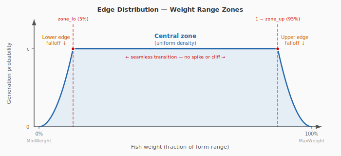

# Fish Weight Generation: Edge Distribution System

> **Target audience:** Game Designers (primary), QA, Server Developers
> **Related tasks:** [FP-41845](https://fishingplanet.atlassian.net/browse/FP-41845), [FP-41844](https://fishingplanet.atlassian.net/browse/FP-41844)
> **Supersedes:** [Leaderboards: Fish records and Improving the randomization of fish weight generation](https://fishingplanet.atlassian.net/wiki/spaces/FP/pages/4219830273)

---

## Problem

Fish weight within each form range (e.g. 80–130 kg for Trophy) was generated uniformly — every weight in the range was equally likely, including values at or near the maximum.

This led to three observable effects:

- **Leaderboard saturation.** Players routinely caught fish at maximum weight. Top leaderboard entries clustered at the ceiling with no meaningful spread.
- **Synthetic feel.** Leaderboards looked artificial — records were set and broken trivially, reducing competitive motivation.
- **No sense of rarity.** Catching a fish 1 gram below the maximum was as likely as catching one in the middle of the range.

Statistical analysis over 5 weeks on Steam confirmed the problem: players set boundary records (fish at maximum weight) multiple weeks in a row. One player set 40 potential records in 5 weeks. Details: [Leaderboards statistics page](https://fishingplanet.atlassian.net/wiki/spaces/FP/pages/4219830273).

### Previous Attempt (FP-33182)

The first fix (r12950) replaced uniform generation in the top 5% of the weight range with a Marsaglia normal distribution. While the intent was correct, the implementation had a structural flaw: the edge zone received a fixed 5% probability budget regardless of the distribution shape, creating a visible density discontinuity (a "spike" or "seam") at the 95% boundary. This artifact was clearly visible in production FishFact data.

The edge distribution system replaces this approach entirely.

## How It Works

### Concept

The weight range is divided into zones:



- **Central zone** — uniform distribution, unchanged. Every weight in this range is equally likely.
- **Edge zones** — probability decreases smoothly from the central zone level down to zero (or near zero) at the boundary. The transition is seamless — no visible cliff or spike.

The key property: catching a fish at 95% of max weight is almost as likely as at 50%. But catching one at 99% is noticeably rarer, and at 100% — extremely rare or impossible (depending on the algorithm).

### Pipeline

The generation pipeline for BiteSystem fish (Source='B', the primary production path):

1. Draw a uniform random number `u ∈ [0, 1]`
2. Apply **edge distribution** — remap `u` using the normalized piecewise inverse CDF. This adjusts the probability in edge zones while keeping the central zone uniform
3. Map to weight: `weight = Lerp(MinWeight, MaxWeight, u) * weightK`
4. **Crossover detection** — if weight falls outside the form's `[min, max]` range (due to `weightK`), reassign to the matching form
5. Round to grams (`Math.Round(decimal, 3, AwayFromZero)`)

Edge distribution operates on the normalized position (step 2), before the weight mapping. The actual min/max weight values, `weightK`, and crossover logic are unaffected.

## Algorithms

Four algorithms are available, selectable via `GlobalVariables`:

### PowerLaw

Probability in the edge zone follows `(1 − s)^α`, where `s` is the position within the edge zone (0 = boundary with central zone, 1 = maximum weight).

- **Density at maximum = exactly zero.** Before rounding, a fish at exactly `MaxWeight` is mathematically impossible. See the note below on rounding effects.
- Parameter `α` (steepness) controls the curve shape:
  - `α = 1` — linear ramp (gentle, gradual decrease)
  - `α = 2` — quadratic (moderate — recommended starting point)
  - `α = 5+` — steep (most edge fish cluster near the boundary)

Think of it as: the world record has a hard ceiling that can be approached but never reached.

~~~panel type=note
**Rounding and `MaxWeight`.** While the density function is exactly zero at `MaxWeight`, the final rounding step (to grams) can theoretically round a weight just below the boundary up to `MaxWeight`. The probability depends on the **cardinality** of the weight range — the more distinct gram values in the range, the smaller the rounding catchment relative to the edge zone:

| Weight range     | Distinct grams | Chance per fish (α=2, zone=5%) |
|------------------|----------------|--------------------------------|
| 0.1–0.5 kg       | 400            | ~1:3,700,000                   |
| 80–130 kg        | 50,000         | ~1:7,000,000,000,000           |
| 40–620 kg        | 580,000        | ~1:11,000,000,000,000,000      |

For all practical purposes, `MaxWeight` is unreachable with PowerLaw.
~~~

### Exponential

Probability in the edge zone follows `e^(−λ·s)`.

- **Density at maximum > 0** but vanishingly small. A fish at `MaxWeight` is theoretically possible but astronomically unlikely.
- Parameter `λ` (rate) controls the falloff:
  - `λ = 3` — gentle (5% of uniform density remains at max)
  - `λ = 7` — moderate (0.1% at max — recommended starting point)
  - `λ = 15` — aggressive (0.00003% at max — essentially zero)

Think of it as: the world record is always theoretically beatable, creating aspiration even if it practically never happens.

### Comparison

| Property                   | PowerLaw            | Exponential                | None             | Uniform   |
|----------------------------|---------------------|----------------------------|------------------|-----------|
| Fish at max weight         | Near-impossible*    | Vanishingly rare           | Impossible       | Common    |
| Transition at boundary     | Seamless            | Seamless                   | Hard cutoff      | N/A       |
| Tuning parameter           | α (steepness)       | λ (rate)                   | —                | —         |
| Average weight shift       | ~1–3% lower         | ~1–3% lower                | Noticeable lower | None      |
| Leaderboard feel           | Hard ceiling, close | Soft ceiling, aspirational | Hard ceiling     | Synthetic |
| Recommended starting value | α = 2               | λ = 7                      | —                | —         |

*\* PowerLaw density is exactly zero at `MaxWeight` before rounding. Rounding to grams can theoretically produce `MaxWeight`, but the probability is vanishingly small — comparable to Exponential with high λ.*

### Which One to Choose?

- **PowerLaw** — hard mathematical ceiling.
  - Density at `MaxWeight` is **exactly zero** before rounding. Rounding can theoretically produce it, but the probability is **vanishingly small**.
  - Good for forms where the absolute maximum should feel like a **legend**.
- **Exponential** — soft ceiling with theoretical possibility of a perfect fish.
  - `MaxWeight` is **reachable but astronomically unlikely** — creates aspiration.
  - Good for forms where the **rare record-breaker** creates excitement.

### Fallback Algorithms (None, Uniform)

These are **not intended for production use.** They exist as fail-safe defaults and debugging tools. Neither provides a smooth density falloff — they either cut off the edge zone entirely or leave it fully uniform.

~~~panel type=warning
Using either of these algorithms in production means **no edge rarity** — leaderboards will saturate or the edge zone will be completely inaccessible.
~~~

#### None (CapAtThreshold) — default

Fish **cannot** be generated in the edge zone at all. Hard ceiling at the zone boundary.

- Upper edge zone = 5% → maximum achievable weight is 95% of the form range
- Use case: maximum restriction while tuning other parameters.
- **Fail-safe default** — activates automatically when `GlobalVariables` are missing or fail to load.
- Switching from `None` to a real algorithm opens this previously empty zone — expect a **burst of new leaderboard records** in the period immediately after the switch.

#### Uniform (Unrestricted)

No edge distribution — pure uniform generation across the full range.

- **Record weights are generated as often as average weights** — no rarity.
- Leaderboards will **saturate** quickly.
- Use only to **temporarily disable the system** for debugging or A/B comparison.
- This is close to the pre-FP-41845 behavior, but not identical: the old system also had form-specific polynomials that distorted the distribution for Young (skewed toward heavier) and Unique (bimodal double-hump). Those polynomials have been removed. Common and Trophy were unaffected by polynomials and were truly uniform.

## Configuration

All parameters are stored in the `GlobalVariables` table and can be changed at runtime via WebAdmin without server restart.

| GlobalVariable                               |  Type  | Default | Description                                                                    |
|----------------------------------------------|:------:|:-------:|--------------------------------------------------------------------------------|
| `BiteSystem.FishWeightEdgeDistribution`      | string | `None`  | Active algorithm: `None`, `Uniform`, `PowerLaw`, `Exponential`                 |
| `BiteSystem.FishWeightEdgeScope`             | string |  `All`  | Which forms and edges are affected (see [Scope](#scope-which-forms-and-edges)) |
| `BiteSystem.FishWeightUpperEdgeZoneFraction` | float  | `0.05`  | Upper edge zone size as fraction of the weight range                           |
| `BiteSystem.FishWeightLowerEdgeZoneFraction` | float  | `0.05`  | Lower edge zone size as fraction of the weight range                           |
| `BiteSystem.FishWeightEdgePowerLawSteepness` | float  |  `2.0`  | α parameter for PowerLaw                                                       |
| `BiteSystem.FishWeightEdgeExponentialRate`   | float  |  `7.0`  | λ parameter for Exponential                                                    |

### Zone Fraction

Zone fraction defines what portion of the weight range is the "edge zone":

- `0.05` (5%) — the top 5% of the weight range gets the falloff. For a fish with range 80–130 kg, the edge zone is 127.5–130 kg.
- `0.10` (10%) — wider edge, more gradual rarity increase. Edge zone = 125–130 kg.
- `0.00` — edge distribution disabled for that side (no edge zone).

Upper and lower zones are independent. Setting lower zone to 0 disables the lower edge entirely (fish near `MinWeight` stay uniformly distributed).

**Overlap guard:** if `upperZone + lowerZone > 0.80`, both are proportionally shrunk to ensure at least 20% of the range remains as the uniform central zone.

### Activation Checklist

To enable edge distribution on production:

1. Set `FishWeightEdgeDistribution` to `PowerLaw` or `Exponential`
2. Set `FishWeightEdgeScope` to the desired scope (e.g. `Heaviest` for upper edge on the heaviest form only)
3. Adjust zone fractions if needed (defaults are 5% per side)
4. Adjust algorithm parameters (steepness / rate) — use the WebAdmin simulator to preview the effect
5. **Save** settings in WebAdmin (writes to `GlobalVariables`)
6. **Refresh Caches** in WebAdmin (pushes to game servers)

## Scope: Which Forms and Edges

Edge distribution does not have to apply to all forms equally. The **scope** controls which (form × edge) combinations are active.

### Form Roles

Forms are classified by their position in the weight hierarchy **per species on the specific pond** (not globally):

- **Heaviest** — the form with the highest `MaxWeight`. Typically Unique. This is the primary target for upper edge distribution — limiting record weights on leaderboards.
- **Lightest** — the form with the lowest `MinWeight`. Typically Young. Lower edge distribution here prevents generation of abnormally light fish.
- **Others** — all forms in between. Typically Common and Trophy. Edge distribution on these forms provides consistent behavior but is less critical for leaderboard dynamics.

~~~expand title="Role assignment with fewer than 4 forms"
Not all species have all four forms on every pond. As the number of forms decreases, roles collapse:

| Forms on pond | Heaviest      | Lightest      | Others                 | Implications                                                         |
|:-------------:|---------------|---------------|------------------------|----------------------------------------------------------------------|
|       4       | Unique        | Young         | Common, Trophy         | All three roles populated — all flags functional                     |
|       3       | heaviest form | lightest form | the single middle form | `Others` flags apply to **one** form only                            |
|       2       | heavier form  | lighter form  | —                      | **`Others` is empty** — `OthersUpper`/`OthersLower` have no effect   |
|       1       | the only form | the only form | —                      | Single form is **both Heaviest and Lightest** — both flag sets apply |

Practical impact: presets like `Heaviest` and `Extremes` work correctly regardless of form count — they target roles, not specific forms. `Others`-based flags (`AllUpper`, `ExtremesAndAllUpper`) become partially or fully inert with fewer than 3 forms.
~~~

### Scope Presets

| Preset                | Bit pattern | Effect                                                   |
|-----------------------|-------------|----------------------------------------------------------|
| `None`                | `------`    | Edge distribution disabled entirely                      |
| `Heaviest`            | `u-----`    | Upper edge on heaviest form only — most conservative     |
| `Extremes`            | `u--l--`    | Upper on heaviest + Lower on lightest                    |
| `AllUpper`            | `u-u-u-`    | Upper edge on all forms — every form gets decay near max |
| `ExtremesAndAllUpper` | `u-ulu-`    | Extremes + upper edge on all others — balanced setting   |
| `All`                 | `ululul`    | Both edges on all forms — most aggressive                |

~~~expand title="Bit pattern reference"
Each position in the 6-character pattern corresponds to one (form role × edge side) flag:

```
u  l  u  l  u  l        ← example: All
│  │  │  │  │  │
│  │  │  │  │  └─ Others Lower     (32)
│  │  │  │  └──── Others Upper     (16)
│  │  │  └─────── Lightest Lower    (8)
│  │  └────────── Lightest Upper    (4)
│  └───────────── Heaviest Lower    (2)
└──────────────── Heaviest Upper    (1)
```

`u` = upper edge on, `l` = lower edge on, `-` = off

Examples:
```
Heaviest              u-----    HeaviestUpper
Extremes              u--l--    HeaviestUpper + LightestLower
AllUpper              u-u-u-    HeaviestUpper + LightestUpper + OthersUpper
ExtremesAndAllUpper   u-ulu-    HeaviestUpper + LightestUpper + LightestLower + OthersUpper
All                   ululul    all six flags
```
~~~

~~~panel type=warning
`Scope = None` disables edge distribution entirely, regardless of the selected algorithm. The heaviest form (typically Unique) will have no upper edge restriction — record weights will be generated at the same rate as average weights.
~~~

~~~panel type=note
`Scope = All` is the default fallback. It applies the same edge treatment to all forms on both sides. In most cases, a more targeted scope (e.g. `Heaviest` or `Extremes`) is preferred — it keeps the edge restriction where it matters most (heaviest form's upper edge) while leaving other forms unaffected.
~~~

### Custom Combinations

Custom scopes can be set via comma-separated flag names in `GlobalVariables`:

```
"HeaviestUpper, LightestLower"        → upper on Unique + lower on Young
"HeaviestUpper, OthersUpper"          → upper edge on Unique, Common, Trophy (but not Young)
"HeaviestUpper, HeaviestLower"        → both edges on Unique only
```

These examples assume 4 forms. For species with fewer forms, see the role assignment table in [Form Roles](#form-roles) above.

### Recommended Configurations

| Goal                                          | Scope      | Rationale                                                                                                                                                                                                         |
|-----------------------------------------------|------------|-------------------------------------------------------------------------------------------------------------------------------------------------------------------------------------------------------------------|
| Leaderboard rarity (top records only)         | `Heaviest` | Only the heaviest form's upper edge is affected                                                                                                                                                                   |
| Leaderboard rarity + protect lightest records | `Extremes` | Heavy forms can't reach max, light forms can't reach min                                                                                                                                                          |
| Consistent behavior across all forms          | `All`      | Every form has the same edge treatment. **Note:** adjacent forms share boundaries (e.g. Trophy max ≈ Unique min) — applying both upper and lower edges creates a **double density dip** at the seam between forms |
| Testing on one form before rollout            | `Heaviest` | Minimal blast radius                                                                                                                                                                                              |

## WebAdmin Tools

### Fish Weight Simulator

**Location:** ***Content > Fishing > Fish Weight Generator***

The simulator generates N fish weights using the **real production code** (not a separate model) and displays the resulting weight distribution as an area chart.

**How to use:**

1. Select a pond and fish species
2. Set the number of iterations (default 1M per form, max 20M)
3. Adjust edge distribution parameters (algorithm, zone fractions, steepness/rate)
4. Click ***Simulate*** — the chart shows the weight distribution per form with shared tooltips

The simulator uses the form values currently set in the UI, not the saved `GlobalVariables` values. This allows previewing changes before saving.

**Chart features:**
- Area chart with per-form toggle (***Young***/***Common***/***Trophy***/***Unique***)
- Tooltips with bucket weight range, count, and percentage
- TSV export for spreadsheet analysis

### Preview Curves

**Location:** ***Preview Curves*** button on the ***Fish Weight Generator*** page

Interactive canvas showing the edge distribution curve shape:

- Crosshair with legend
- Sidebar with sliders for ***Zone Fraction***, ***Steepness*** (α), ***Rate*** (λ)
- Toggle between ***Upper*** and ***Lower*** edge
- Non-linear sliders for intuitive parameter adjustment
- Shows the actual probability density shape — what the player experiences

Use this to visually compare how different parameter values affect the probability falloff before running a full simulation.

### Settings Panel

The same page provides controls to save edge distribution parameters to `GlobalVariables`:

- ***Save*** — writes current settings to the database (requires ***Game Designer*** role). Includes a confirmation dialog with mandatory comment.
- ***Refresh Caches*** — pushes updated `GlobalVariables` to all connected game servers.
- ***Reset*** — reverts all fields to the currently saved values (from `GlobalVariablesCache`).

Changes are audited via the `DataChanges` system (who changed what, when, with what comment).

## WeightK — Groundbait Weight Multiplier

`weightK` is a weight multiplier from the **chum (groundbait) system**. When a player uses chum with weight-affecting particles, `weightK > 1.0`, and generated fish weights are multiplied by this factor.

**How it interacts with edge distribution:**

```
Edge distribution → weight mapping → × weightK → crossover detection
    (step 2)          (step 3)        (step 3)      (step 4)
```

Edge distribution and `weightK` are **independent mechanisms**:

- Edge distribution shapes the probability within the form's natural range (before `weightK`)
- `weightK` stretches the result beyond the form maximum (after edge distribution)
- Edge distribution does **not** suppress or amplify the `weightK` effect

**Example:** Trophy range 80–130 kg, upper edge zone 5% (127.5–130 kg), PowerLaw α=2.

- Without chum (`weightK`=1.0): fish in 127.5–130 kg are progressively rarer. Fish at 130 kg is impossible.
- With chum (`weightK`=1.05): the 130 kg cap becomes 136.5 kg. A fish generated at 95% of the range (127.5 kg) gets multiplied to 133.9 kg — crossing into Unique territory (crossover). The edge distribution still applies within the 95–100% zone of the original range; `weightK` then stretches the result.

**Key point for GD:** Edge distribution controls rarity within the natural weight range. `weightK` controls how far chum can push fish beyond that range. The two systems are tuned independently.

## Migration from Old System

### What Was Removed

| Component                                    | Status  | Reason                                                                                                            |
|----------------------------------------------|---------|-------------------------------------------------------------------------------------------------------------------|
| Form polynomials (`_formToNorm`)             | Removed | Distorted the entire distribution (Young skew, Unique double-hump) instead of targeting just the edge zone        |
| Marsaglia re-roll (r12950)                   | Removed | Created density seam at the 95% boundary — structural flaw, not a tuning problem                                  |
| `UseNormalDistributionForFishGeneratingFrom` | Renamed | → `FishWeightUpperEdgeZoneFraction` (value converted: `1.0 - old`)                                                |
| `NormalDistributionForFishGeneratingSigma`   | Deleted | No longer needed — edge functions have their own parameters                                                       |
| Double `weightK` application                 | Fixed   | `weightK` was applied both to the normalized input and to the final weight. Now applied once, to the final weight |

### What Was Added

| Component                      | Purpose                                                                                     |
|--------------------------------|---------------------------------------------------------------------------------------------|
| `FishWeightGenerator` class    | Centralized weight generation pipeline (was spread across `FishDescription` + `PondServer`) |
| `FishWeightGeneratorConfig`    | Immutable runtime config, hot-reloadable via `GlobalVariables`                              |
| 4 edge distribution strategies | `CapAtThreshold`, `Unrestricted`, `PowerLawEdge`, `ExponentialEdge`                         |
| `EdgeDistributionScope` flags  | Per-form, per-edge granular control                                                         |
| WebAdmin Settings UI           | Save / Refresh / Reset with audit trail                                                     |
| WebAdmin Simulator             | Statistical preview using real production code                                              |
| WebAdmin Preview Curves        | Interactive visual curve explorer                                                           |
| `FishWeightRounding` constants | Shared rounding between production and simulator                                            |

### Data Continuity

- **FishFact statistics are not affected.** The table records actual generated weights — historical data remains valid for comparison.
- **Default behavior (`None`)** is more restrictive than the old system: it hard-caps at the edge zone boundary. To restore pre-change behavior, set the algorithm to `Uniform`.
- **The simulator** can reproduce both the old behavior (Uniform) and new configurations, allowing direct comparison.

## See Also

- **[Edge Distribution — Design Analysis](TBD)** — deep dive: algorithm math, normalization, why naive approaches fail, historical context of three failed attempts. For developers and anyone wanting to understand the math behind the system.
- [Leaderboards: Fish records and Improving the randomization](https://fishingplanet.atlassian.net/wiki/spaces/FP/pages/4219830273) — original problem analysis and statistics
- [Алгоритм и формулы новой системы клева](https://fishingplanet.atlassian.net/wiki/spaces/FP/pages/923500587) — BiteSystem design (historical, includes `weightK` from particles)
- [FP-41845](https://fishingplanet.atlassian.net/browse/FP-41845) — implementation task
- [FP-33182](https://fishingplanet.atlassian.net/browse/FP-33182) — previous attempt (Marsaglia re-roll, superseded)
