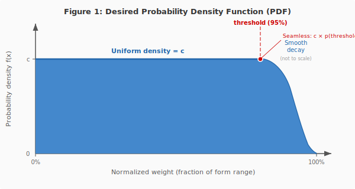
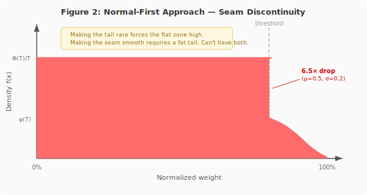
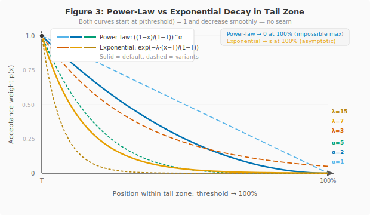

# Weight Decay Curves — Design Analysis

> How to make fish near maximum weight progressively rarer while keeping the rest of the distribution uniform.

Related: [FP-41845](../../tasks/FP-41845--weight-generation-v2/journal.md) (Phase 2a) | [Interactive comparison tool](decay-comparison.html)

---

## 1. Problem Statement

Fish weight within a form range (e.g. 80–130 kg for Trophy) is generated uniformly. Every weight in the range is equally likely, including values very close to the maximum. In practice this means:

- Players routinely catch fish at or near max weight
- Leaderboard records are set and broken trivially — top entries cluster at the ceiling
- The leaderboard feels "synthetic": no meaningful spread, no sense of rarity

**Goal:** Introduce a smooth density falloff in the upper portion of the weight range so that fish near the maximum become progressively rarer, while preserving uniform distribution across most of the range.

In plain terms: catching a 129 kg Trophy should feel special. Catching a 130 kg one should be an event. The decay curve makes this happen mathematically.

## 2. Desired Distribution Shape

The target probability density function (PDF) is piecewise:

```
f(x) = c,            for x ∈ [0, threshold]      — uniform zone
f(x) = c · p(x),     for x ∈ (threshold, 1]      — decay zone
```

where `x` is the normalized weight position within the form range (0 = MinWeight, 1 = MaxWeight), `threshold` is the boundary (e.g. 0.95), `p(x)` is a decay function satisfying `p(threshold) = 1` and `p(x) → 0` as `x → 1`, and `c` is a normalization constant ensuring the total area equals 1.



The constraint `p(threshold) = 1` is critical — it guarantees that the density is **continuous at the seam**. There is no visible cliff or jump where the uniform zone meets the decay zone.

Think of it like a plateau that smoothly transitions into a downhill slope. The flat part (uniform zone) is the plateau; the declining part (decay zone) is the slope. The transition point (threshold) must be seamless — no sudden step.

**Normalization constant:**

```
c = 1 / (threshold + ∫[threshold,1] p(x) dx)
```

Because the decay zone has less area than a uniform zone of the same width, `c` is slightly higher than `1/1 = 1`. In practice (threshold = 0.95, moderate decay), the flat zone density rises by about 1–3% compared to pure uniform — negligible for game balance.

## 3. Candidate Approaches

Three approaches were evaluated for generating weights from this distribution.

### 3.1 Normal-First (Generate-and-Reroute)

**Algorithm:**
1. Generate `x ~ Normal(μ, σ)`
2. If `x > threshold` → accept (this IS the decay tail)
3. Else → discard, output `y ~ Uniform(0, threshold)` instead

**Resulting PDF:**

```
f(x) = Φ(T; μ, σ) / T,     for x ∈ [0, T]     — flat, height depends on how much of the normal falls below T
f(x) = φ(x; μ, σ),          for x > T           — raw normal PDF
```

where `Φ` is the normal CDF and `φ` is the normal PDF.

The intuition: most rolls from the normal distribution fall below threshold and get replaced with uniform. The rare rolls above threshold survive and form the tail.

**The Seam Problem:**

At `x = threshold`, the density jumps from `Φ(T)/T` (left) to `φ(T)` (right). These two values are **generally not equal**.



Concrete examples (threshold = 0.95):

| μ    | σ    | Left density | Right density | Ratio  | P(tail) |
|------|------|--------------|---------------|--------|---------|
| 0.50 | 0.20 | 1.040        | 0.159         | 6.5× ↓ | 1.2%    |
| 0.50 | 0.55 | 0.835        | 0.515         | 1.6× ↓ | 20.7%   |
| 0.80 | 0.55 | 0.640        | 0.700         | ~1.0   | 39.3%   |

This reveals a fundamental tension:

- **Rare tail** (small σ, μ well below threshold) → large seam discontinuity
- **Smooth seam** (μ near threshold, large σ) → fat tail (30–40% of fish in decay zone)

These goals pull the parameters in opposite directions. There is no (μ, σ) combination that simultaneously produces a rare tail AND a smooth seam.

In simpler terms: the normal distribution wasn't designed for this job. We're trying to use its tail as a decay curve, but the price is a visible cliff at the boundary. It's like trying to join a flat road to a mountain slope by parking a car on the edge — the transition isn't smooth.

**Verdict: Rejected.** The seam discontinuity is structural, not a tuning problem.

### 3.2 Power-Law Decay

**Decay function:**

```
p(x) = ((1 - x) / (1 - threshold))^α
```

where `α > 0` is the steepness parameter.

**Properties:**
- `p(threshold) = 1` — seamless by construction
- `p(1) = 0` — density is exactly zero at max weight (impossible to generate)
- `α` controls the curve shape:
  - `α = 1`: linear decay (straight line from threshold to max)
  - `α = 2`: quadratic (concave, gentle start then steeper)
  - `α = 5+`: very steep (most tail fish cluster near threshold)

**Closed-form sampling** (no rejection needed):

```
tail_area = (1 - threshold) / (α + 1)
total_area = threshold + tail_area

u = random()
if u < threshold / total_area:
    weight = uniform(0, threshold)
else:
    weight = 1 - (1 - threshold) × (1 - uniform())^(1/(α+1))
```

The elegance here is that inverse CDF sampling works out to a simple formula. Each fish requires exactly one random number (two at most — one for the zone choice, one for the position within the zone).

Think of it as a ramp that gets steeper as you approach the edge: with `α = 2`, the first half of the decay zone still has reasonable density, but the last quarter drops off sharply. With `α = 5`, almost everything bunches near the start of the decay zone and the upper end is practically empty.

**Note on max weight:** Since `p(1) = 0`, a fish at exactly MaxWeight is mathematically impossible. In practice, with floating-point arithmetic and millions of samples, you'll see fish at 99.999...% — effectively indistinguishable from max. The theoretical zero at the boundary is academic, not practical.

### 3.3 Exponential Decay

**Decay function:**

```
p(x) = exp(-λ · (x - threshold) / (1 - threshold))
```

where `λ > 0` is the steepness parameter.

**Properties:**
- `p(threshold) = exp(0) = 1` — seamless by construction
- `p(1) = exp(-λ)` — density approaches but never reaches zero (asymptotic)
- `λ` controls the decay rate:
  - `λ = 3`: gentle (exp(-3) ≈ 0.05 — 5% of uniform density at max)
  - `λ = 7`: moderate (exp(-7) ≈ 0.001 — 0.1% at max)
  - `λ = 15`: aggressive (exp(-15) ≈ 3×10⁻⁷ — essentially zero)

**Closed-form sampling** (truncated exponential on [threshold, 1]):

```
tail_area = (1 - threshold) × (1 - exp(-λ)) / λ
total_area = threshold + tail_area

u = random()
if u < threshold / total_area:
    weight = uniform(0, threshold)
else:
    max_cdf = 1 - exp(-λ)
    weight = threshold + (1 - threshold) × (-ln(1 - uniform() × max_cdf) / λ)
```

The key difference from power-law: the exponential never truly reaches zero. No matter how large `λ` is, there's always some (astronomically small) probability of generating a fish at exactly max weight. This is the "asymptotic" behavior — the curve approaches the floor but never touches it.

In game terms: the world record is always theoretically beatable. With power-law, there's a hard ceiling; with exponential, there's a soft one.



## 4. Comparison

| Property                     | Normal-First          | Power-Law              | Exponential            |
|------------------------------|-----------------------|------------------------|------------------------|
| Seam at threshold            | **Discontinuous**     | Continuous             | Continuous             |
| Density at 100%              | > 0 (normal tail)     | = 0 (hard zero)        | > 0 (asymptotic)       |
| Parameters                   | μ, σ (coupled)        | α (single, intuitive)  | λ (single, intuitive)  |
| Parameter meaning            | Indirect              | "Steepness exponent"   | "Decay rate"           |
| Sampling                     | 1 rejection + 1 roll  | Closed-form, O(1)      | Closed-form, O(1)      |
| Average weight shift         | ~1–3% lower           | ~1–3% lower            | ~1–3% lower            |
| Max weight achievable        | Yes (rare)            | No (exactly zero)      | Yes (vanishingly rare) |
| GD tunability                | Hard (μ/σ interact)   | Easy (single slider)   | Easy (single slider)   |

### WeightK Interaction

All three approaches operate on the **pre-WeightK** normalized weight. The `weightK` multiplier (from the chum/groundbait system) is applied **after** the decay curve, as a simple multiplication of the final weight. This means:

- Decay shapes the distribution within the form's natural range
- WeightK stretches the result beyond the form maximum (oversize fish)
- The two mechanisms are independent — decay does not suppress or amplify WeightK

## 5. Decision

**Normal-first: rejected.** The seam discontinuity is fundamental, not fixable by parameter tuning.

**Power-law and exponential: both implemented** with a GlobalVariable switch. Game designers can evaluate both in the [interactive comparison tool](decay-comparison.html) and the WebAdmin simulator, then choose based on gameplay feel.

The practical difference is philosophical: power-law says "there is a maximum, and it's unreachable." Exponential says "the maximum is reachable, but astronomically unlikely." For leaderboard dynamics, the exponential may be more compelling — the theoretical possibility of a perfect fish creates aspiration, even if it never actually happens.

## 6. Historical Context

The FP-33182 implementation (r12950) attempted to solve the same problem using a threshold-based re-roll to Marsaglia normal distribution. This was effectively a variant of the normal-first approach: if a uniform roll fell in the edge zones (0–5% or 95–100%), it was re-generated using a normal distribution.

Earlier still, Max Komisarenko attempted to achieve the decay effect through form-specific polynomials (cubic regression fitted to control points). The Unique polynomial was intended to create a similar density falloff at the upper end, but the polynomial approach distorted the **entire** distribution rather than just the tail, producing the characteristic double-hump artifact visible in production data.

Both approaches had the right intuition (make edge weights rare) but used the wrong tool. The piecewise approach (uniform + targeted tail decay) achieves the goal without distorting the bulk of the distribution.
