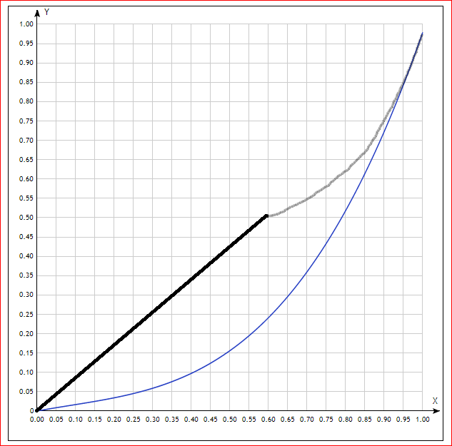
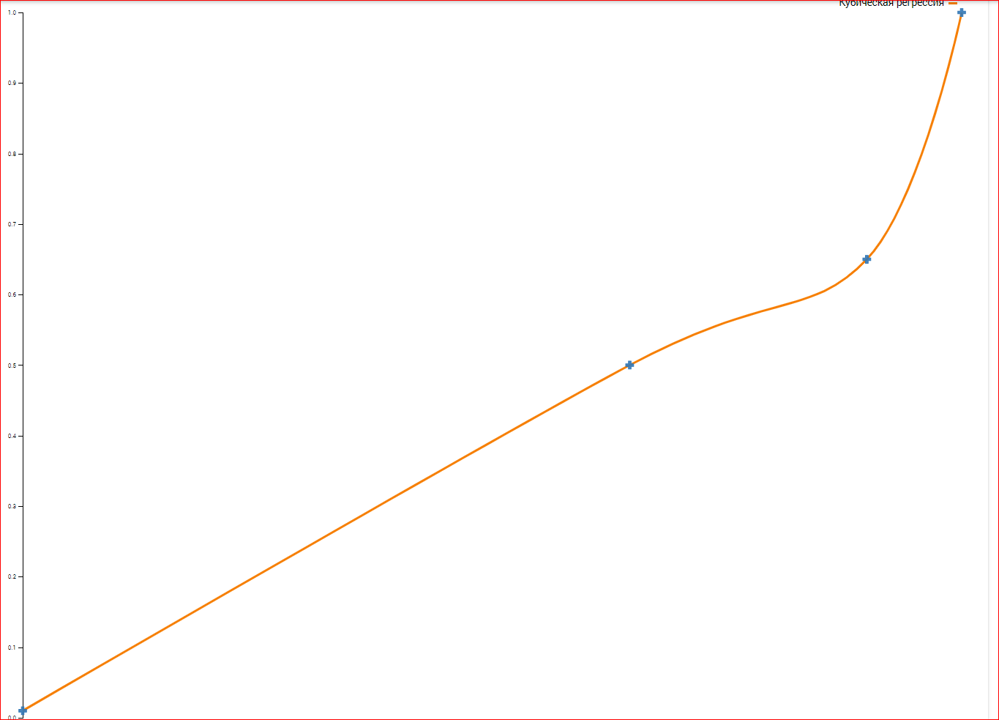

# Weight Generation Bias — Historical Context

Source: [Confluence — Алгоритм и формулы новой системы клева, section "Генерация веса рыбы, bias"](https://fishingplanet.atlassian.net/wiki/spaces/FP/pages/923500587#%D0%93%D0%B5%D0%BD%D0%B5%D1%80%D0%B0%D1%86%D0%B8%D1%8F-%D0%B2%D0%B5%D1%81%D0%B0-%D1%80%D1%8B%D0%B1%D1%8B%2C-bias)
Snapshot date: 2026-03-12
Original author: Mary Key (doc), Max (implementation)

---

## Weight bias polynomials (pre-FP-33182)

Code was added to bias weight generation per form:
- **Young** — bias toward upper end of weight range
- **Unique** — originally biased toward lower end; changed 22.01.2020 to bias toward middle

### Unique polynomial evolution

**Old (blue curve):** convex, below y=x diagonal — biases toward lower weights.

**New (black+grey, Jan 2020):** S-shaped, crosses y=x around 0.55 — shifts generation toward middle of range.

### Max's cubic regression attempt

Max attempted to approximate the desired curve with a cubic regression ("Кубическая регрессия"). Control points approximately at (0, 0.01), (0.75, 0.5), (0.93, 0.65), (1.0, 1.0).

The curve stays flat/slow for most of the range, then rises steeply near x=1.0. Effect: with uniform input x ∈ [0,1], most output values compress into the lower-to-middle range, making weights near maximum extremely rare — the asymptotic decay behavior GD wanted.

### Outcome

The polynomial approach applied to the entire Unique form range produced artifacts (double-hump distribution). The desired asymptotic decay effect was not cleanly achieved through form-wide polynomial distortion.

In Phase 2a (FP-41845), this is replaced by a targeted decay mechanism applied only in the [threshold%, 100%] zone of the elder form, without distorting the rest of the distribution.

## WeightK from particles (chum system)

Particles affect fish weight via a multiplier (`weightK`). If the resulting weight exceeds the current form's max, a fish of the next form is generated (crossover).

- `weightK` is calculated once at mixing time
- Per chum layer: influence = `MaxEffect / OptimalBiteChumLayersCount`
- Log format: `(0.1kg - 0.3kg) => 0.239kg(WeightK = 1.0002)`
