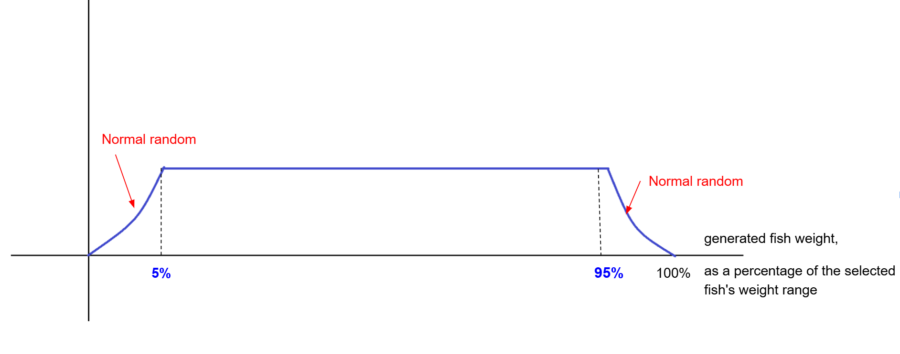

# Leaderboards: Fish records and Improving the randomization of fish weight generation

Source: [Confluence FP page 4219830273](https://fishingplanet.atlassian.net/wiki/spaces/FP/pages/4219830273/Leaderboards+Fish+records+and+Improving+the+randomization+of+fish+weight+generation)
Snapshot date: 2026-03-12
Related JIRA: [FP-41842](https://fishingplanet.atlassian.net/browse/FP-41842), [FP-33182](https://fishingplanet.atlassian.net/browse/FP-33182)

---

## Overview

В цьому документі аналізуєтся статистика, яка була зібрана на плаформі Steam за 5 календарних тижнів ([посилання на таблицю зі статистикою](https://docs.google.com/spreadsheets/d/1WG0kfdv-KgsXPieE6py1tZ6uHabl4pWt40UaKyDiIns/edit?gid=0#gid=0)) та висувається гіпотеза по можливій кількості поставлених рибних рекордів на гравця за різні періоди часу.

Описано рішення по покращенню рандомізації генерації граничної ваги риби.

## Basic information about current fish record stats

Факти які зафіксовані у зібраній статистиці:

- за 5 тижнів **1503** унікальних гравця поставили **1931** потенційний рибний рекорд
- більша частина гравців представлених в таблиці (**1300**) поставила за 5 календарних тижнів **1** рекорд, відповідно **203** гравців поставили **2** і **більше** рекордів
- найбільшу кількість рекордів за всі 5 тижнів — **40** — поставив гравець D866CAA1, шо потенційно могло б йому принести ~**812 000** кредитів на тижневих рибних рекордах, ~**2 572 000** на місячних та ~**37 141 000** кредитів якщо допустити що ці рекорди залишаться річними
- найбільшу кількість рекордів на одному календарному тижні — **15** — поставив гравець 6CC7B086, гравець D866CAA1 поставив **14**. Ці гравці йдуть з великим відривом від загальної маси гравців
- гравці 642E291A, 6CC7B086, D866CAA1 змогли поставити рекорди всі **5** календарних тижнів поспіль
- гравець 6CC7B086 поставив рекорд на один і той самий вид риби **4** тижні поспіль
- гравці 5ECA0DB2, 4C86437E, 642E291A, D866CAA1 поставили рекорд на той самий вид риби **3** тижні поспіль
- **Виявлено проблему: гравці дуже часто ставлять граничний рекорд (виловлюють рибу з максимальним значенням ваги) декілька тижнів поспіль і із-за цього лідерборди будуть виглядати дуже "синтетичними" та нестимулятивними**

## Hypothesis on the possible number of fish records set per player

З зібраної статистики випливає, що на даний момент більшість рекордів були поставлені випадково в процесі "фарму" риби. Але враховуючі, що в цьому випадку не було і конкуренції (яка буде коли за потрапляння лідерборди буде винагорода) то можна припустити, що отримані значення можна брати за основу.

Більшість гравців з тих хто попадуть в лідерборди по рибним рекордам можна умовно розділіти на 3 діапазони:

1. будуть ставити 1–2 рекорди в тижневій лідерборді, 1 рекорд в місячній лідерборді і скоріш за все не будуть представлені у річній лідерборді
2. Середній діапазон гравців буде ставити ~5–10 тижневих рибних рекордів, 2–5 місячних рекорди і 1–2 річних
3. Топ діапазон гравців буде ставити ~10–15 тижневих рибних рекордів, 5–10 місячних рекорди и 5+ річних рекорди. В максимальному випадку (якщо гравець буде ставити всі рекорди на Kaiji No Ri) такий гравець зможе отримати приблизно 1–1,5 млн кредитів за тижневі рибні рекорди, 2,5–5 млн кредитів за місячні рекорди та 32,5 млн кредитів за річні рекорди

В річні лідерборди будуть потрапляти гравці, що будуть цілеспрямовано працювати щоб у цю лідерборду потрапити і будуть це робити навіть якщо винагорода буде не дуже привабливою (просто за можливість засвітитися в рекордах). **Тому краще на релізі "занизити привабливість" винагороди** (шляхом зниження сумм винагород у кредитах).

## Improving the randomization of fish weight generation

### Task

[FP-33182](https://fishingplanet.atlassian.net/browse/FP-33182)

Random generation (normal random), should be improved to make generations close to the edge extremely rare, to make leaderboard to look interesting. This extreme random should be used to generate fish weight.

Generation average should remain the same to preserve the in-game balance.

Define the real numbers of fish count, caught for the year (longest period) — run the random generator test and see the actual top 10 / 100 fish generated. For the fish under 10 kg — the difference should be at least in 1–2 grams. For the fish about 300 kg — the difference should be around 100 gr at least.

### Implementation

We introduced two global variables (the table **GlobalVariables**):

- **UseNormalDistributionForFishGeneratingFrom = 0.95** (default is **0.75** if the variable is not present in the table **GlobalVariables**)
- **NormalDistributionForFishGeneratingSigma = 0.55**

The fish weight generation system was modified:

- If the initially generated fish weight, as a percentage of the selected fish's weight range, falls within **5% to 95%**, the **old uniform distribution** is applied.
- If the initially generated fish weight, as a percentage of the selected fish's weight range, falls within **0–5%** or **95–100%**, the fish weight is **re-generated** within these same ranges but using a **normal distribution** instead.

### Autotest results

**Uniform. Interval (0.1 kg – 1 kg)**
- Medium value: 0.550235814357474 kg
- <33%: 32.9533, 33%–66%: 33.0207, >66%: 34.026
- First values (kg): 0.1000013, 0.1000015, 0.1000025, 0.1000034, 0.1000034, 0.1000041, 0.1000073, 0.1000074, 0.1000082, 0.1000088
- Last values (kg): 0.9999884, 0.9999896, 0.9999913, 0.9999914, 0.9999946, 0.9999962, 0.9999976, 0.9999976, 0.9999986, 0.9999992

**Marsaglia. Interval (0.1 kg – 1 kg)**
- Medium value: 0.550123637067318 kg
- <33%: 4.44, 33%–66%: 90.079, >66%: 5.481
- First values (kg): 0.1373468, 0.1414788, 0.1452446, 0.1522218, 0.1525467, 0.1537326, 0.157934, 0.1610554, 0.165163, 0.1655169
- Last values (kg): 0.9407338, 0.9413404, 0.945018, 0.9462778, 0.9510766, 0.9589426, 0.9602608, 0.9704016, 0.9772485, 0.979893

**Uniform. Interval (10 kg – 30 kg)**
- Medium value: 20.0033014892778 kg
- <33%: 32.9548, 33%–66%: 33.0458, >66%: 33.9994
- First values (kg): 10.00002, 10.00002, 10.00002, 10.00003, 10.0001, 10.0001, 10.00011, 10.00015, 10.00018, 10.0002
- Last values (kg): 29.99973, 29.99977, 29.99979, 29.99981, 29.99983, 29.99984, 29.99989, 29.9999, 29.99993, 29.99997

**Marsaglia. Interval (10 kg – 30 kg)**
- Medium value: 20.0006755162468 kg
- <33%: 4.4664, 33%–66%: 90.091, >66%: 5.4426
- First values (kg): 10.08515, 10.43919, 10.73768, 11.02027, 11.09811, 11.19276, 11.33714, 11.35264, 11.39133, 11.48116
- Last values (kg): 28.69702, 28.7584, 28.90011, 28.95931, 29.03398, 29.06782, 29.16576, 29.27947, 29.40959, 29.95579
